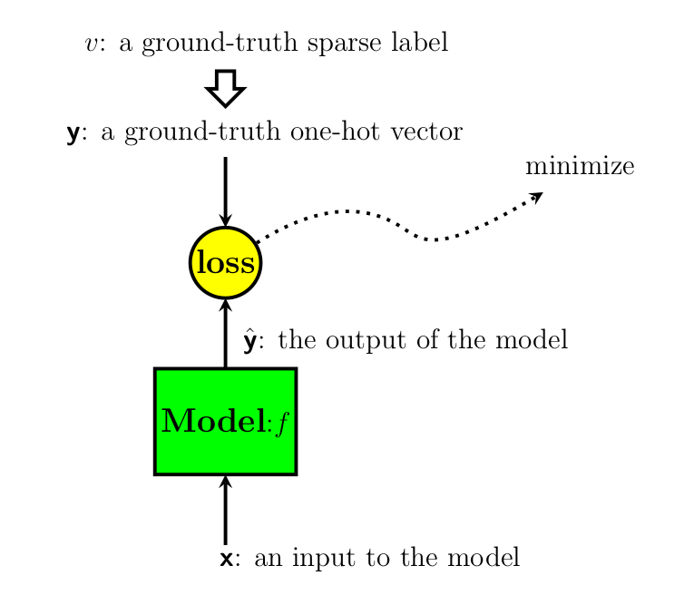

# Neural Network Basics

## Classification problem

There are various applications of neural-network models. In this section, for
simplicity of discussion, we will focus only on *the classification problem*.
In the classification problem, 
when the number of output classes is $V$, then the class index $v$ may take a 
value in the following range:
```{math} 
  :label: output_label
  0 \le v \le V - 1.
```
In stead of the above *sparse representation of the output class*, we may use
*the one-hot vector* representation as below:

Sometimes, the class index $v$ in {eq}`output_label` is referred to as 
*sparse representation* compared to the one-hot vector representation in Table 

## Model

In the classification problem, the model can be considered a function to predict 
the output class probability $\bsf{y}$ given the input $\bsf{x}$. Thus when the
model is represented by a function $f$, the relation is represented by the
following equation. 
```{math}
  :label: model
  \hat{\bsf{y}} = f\left(\bsf{x}\right)

```

## Training Data Set

In this section, we consider the supervised training case, which might be the
most basic case of training neural-network models.
Other cases such as unsupervised or semi-supervised training cases will 
be covered later.


```{math}
  :label: training_set
  \mathcal{T} = \big \{ (\bsf{x}^{(k)},\, \bsf{y}^{(k)})
      \; \big | \; 0 \le k \le N_{\text{tr}} - 1 \big \},
```
where $N_{\text{tr}}$ is the number of examples in the training set
$\mathcal{T}$.


## Loss Function
In training neural network models, our objective is making the model output $\hat{\bsf{y}}$
as close to the ground truth $\bsf{y}$ as possible. To perform this task
analytically, we usually define a certain *loss function* and minimize it.

```{figure-md} model_and_loss 


A model and the corresponding loss.
```

The entire loss $\mathbb{L}$ is defined by the following equation for the
entire training set defined in {eq}`training_set`:

```{math}
  :label: entire_loss
  \mathbb{L} = \frac{1}{N_{\text{tr}}} \sum_{k=0}^{N_{\text{tr} - 1}}
    \text{loss}(\bsf{y}^{(k)}, \hat{\bsf{y}}^{(k)}) 
```
where $N_{tr}$ is the number of training examples as defined in 

Now, the question is what would be a good candidate for the loss function in
{eq}`entire_loss`. Various types of functions may be condidates for this loss
function including the well know $L_1$ or $L_2$ losses and so on.
As will be discussed later, an appropriate loss function is different 
depending on applications. 

In the classification problem, we would like to make the distribution of prediction by 
the model $\hat{\bsf{y}} = f(\bsf{x})$
as close to the distribution of the training data set as possible. In this
classification problem, note that both the ground truth output $\bsf{y}$ and
the predicted output $\hat{\bsf{y}}$ are probability distributions of the set
of output labels defined in {eq}`output_label`.

To measure the difference between two distributions, we may use the KL
divergence or the Cross Entropy (CE). Since the distribution of the training
set is already fixed, minimizing the following Cross Entropy (CE) loss is equvalent to
minizing *the KL divergence*, which is shown in the following equation:


```{math}
  \mathbb{L}_{\text{CE}} & =  H(\bsf{y}, \bsf{\hat{y}}) \\
                         & =  H(\bsf{y}) + D_{\text{KL}} (\bsf{y} || \hat{\bsf{y}})
```
From the definition of cross entropy (CE), $\mathbb{L}_{\text{CE}}$ is given by
the following equation:
```{math}
  :label: ce_loss
  \mathbb{L}_{\text{CE}} 
         & =  -E_{\bsf{y} \sim \text{training_data}} \left[ \log \hat{\bsf{y}} \right]. \\
```
When the one-hot vector representation is used in {eq}`ce_loss`, {eq}`ce_loss`
is calculated as follows:
```{math}
  :label: ce_loss_one_hot
  \mathbb{L}_{\text{CE}} 
         & =  -E_{\bsf{y} \sim \text{training_data}} 
          \left[ \sum_{v=0}^{V-1} y_v   \log \hat{y}_v  \right]. \\
```
where $y_v$ and $\hat{y}_v$ are $v$-th element of the one-hot vector
$\mathbf{y}$ and $\hat{\mathbf{y}}$ respectively, and $V$ is the number of
output classes as shown in {eq}`output_label`.

{eq}`ce_loss_one_hot` may be expressed in summation rather than the expection as
follows:
```{math}
  :label: ce_loss_one_hot_sum
  \mathbb{L}_{\text{CE}} 
         & =  -\sum_{k=0}^{N_{\text{tr}}}
           \sum_{v=0}^{V-1} y^{(k)}_v   \log \hat{y}^{(k)}_v . \\
```
where $y^{(k)}_v$ and $\hat{y}^{(k)}_v$ represent the $v$-th element of the
one-hot vector of the k-th training example $\mathbf{y}^{(k)}$ and the
corresponding predicted output using the model $\hat{\mathbf{y}}^{(k)}$.

In Tensorflow, cross entropy is calculated using
**tf.nn.softmax_cross_entropy_with_logits** for one hot vector representation
and **tf.nn.sparse_softmax_cross_entropy_with_logits** for sparse matrix
representation.


## Gradient Descent 

Suppose that the entire parameters of our neural network model is denoted by
$\mathsf{w}$. If we can directly differentiate the loss function $\mathbb{L}$,
we improve the model parameters using the well-known Gradient Descent approach
as shown below:
\begin{align}
  \bsf{w} \leftarrow  \bsf{w} - \mu \nabla_{\bsf{w}} \mathbb{L}.
\end{align}
where $\mu$ is a constant called the *learning rate*.

It is well known that the direction of the negative of gradient is the
direction of *steepest descent* in the surface defined by the loss function
$\mathbb{L}$.
However, Gradient Descent (GD) is not a practical approach when the training set size is
sufficiently large for the following two reasons.

 - **Inefficiency in computation** <br>
   It is usually not possible to load all the training examples in memory at
once. Thus, we may need to store partial results and part of inputs in the
disk, and repeatedly load and save partial result.

 - **Slow convergence** <br>
    Parameter update is done only once after processing the entire training
set. That is to say, the parameter update is done only once for one *epoch*. 


## Stochastic Gradient Descent (SGD)


Unlike the GD approach using the loss from the entire training dataset, in SGD, 
we update the parameter for each training example $(\bsf{x}^{(k)}, \bsf{y}^{(k)})$ iteratively.

\begin{align}
  \bsf{w} \leftarrow  \bsf{w} - \mu \nabla_{\bsf{w}} \mathbb{L}^{(k)}
\end{align}
where $\mathbb{L}^{(k)}$ is the loss value calculated using only a single
training example $(\bsf{x}^{(k)}, \bsf{y}^{(k)})$ and the prediction by the
model $\hat{\bsf{y}}^{(k)}$:

```{math}
  \mathbb{L}^{(k)} = \text{loss}(\bsf{y}^{(k)}, \hat{\bsf{y}}^{(k)})
```


## Back-Propagation 


## Questions

Q1. Calculate the cross entropy between the following two vectors containing
probability distributions:


Q2. 


